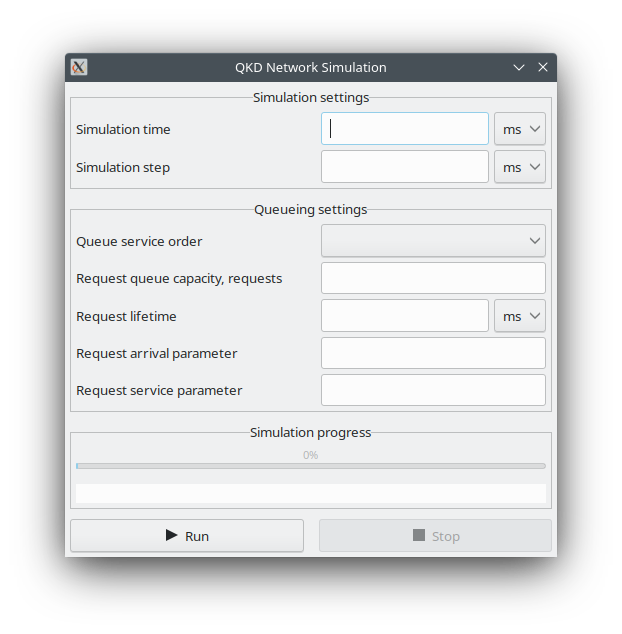
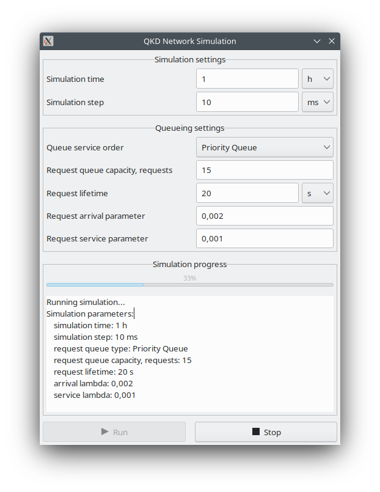
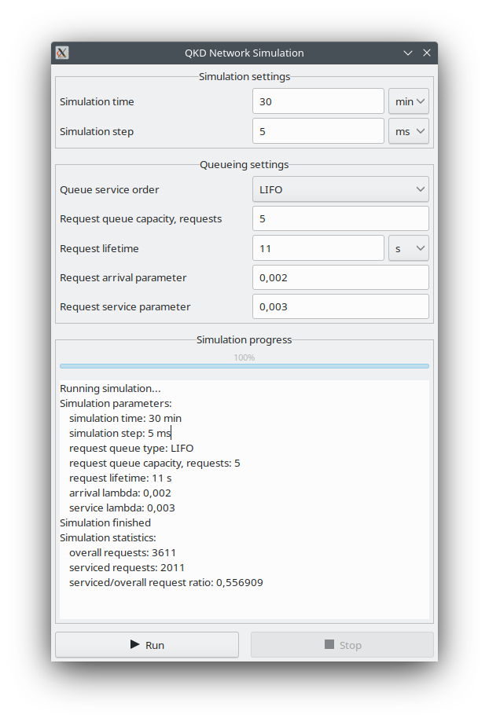

``# qkd - Quantum Key Distribution network simulator

## Overview

**qkd** allows you to estimate throughput of the _Moscow - Saint Petersburg Quantum Distribution Network_ emerged back in 2021 (more info on https://www.interfax.ru/russia/771209) as a queuing system, namely, to determine serviced/overall request ratio depending on request queue service order, capacity, request lifetime, arrivals and services lambda coefficients.

**Currenty available only on Linux.**

_Made by V. Shcherbakov and V. Eliseev, MPEI, 2021_

## Dependencies

Required tools:
* **gcc** (12+) or **clang** (14+) (see _[Building](#building)_);
* **cmake** (3.24+);

Required libraries:
* **gtkmm** (3.x.x);
* **boost.{log, random}**.

### Linux

#### Ubuntu/Debian
```
$ sudo apt install libboost-all-dev libgtkmm-3.0-dev
```
#### Other distributions
WIP

### Other platforms
WIP

## Building

1. Obtain the source, then ```cd``` to **qkd/** directory:
```
$ git clone https://github.com/vicshcher/qkd
$ cd qkd
```

2. Select a compiler.
**qkd** can be built with:
* **gcc** (12+);
* **clang** (14+). 
To choose preferred compiler, edit **build.sh**:
```
CC=gcc \
CXX=/usr/bin/g++ \
```
for **gcc**, and
```
CC=clang \
CXX=/usr/bin/clang++ \
```
for **clang**, respectively.

3. Build it!
```
$ ./build.sh
```
Resulting executable **app** resides in **qkd/** directory. Launch it:
```
./app
```

## Screenshots




